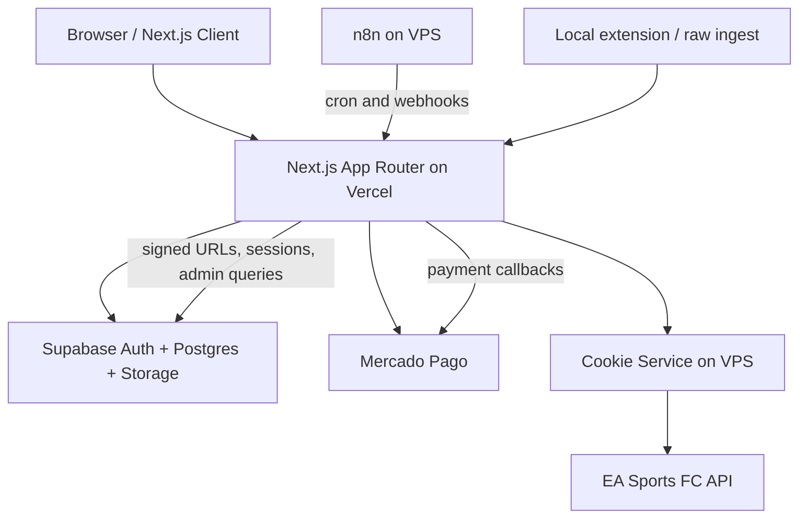

# Architecture

This document maps the major runtime pieces of the P.I.T platform and explains how the app, database, background services, and third-party integrations fit together.

For coding conventions and operational guardrails, see [CLAUDE.md](../CLAUDE.md).

## System Overview



## Main Runtime Responsibilities

| Layer | Responsibility |
| --- | --- |
| Next.js App Router | UI, route handlers, SSR auth, orchestration, server actions by route handlers |
| Supabase | Authentication, relational data, RLS, views, storage, RPCs, triggers |
| Mercado Pago | PIX checkout, refunds, subscription lifecycle callbacks |
| VPS cookie service | Refreshes Akamai cookies needed for EA API access |
| n8n | Schedules cron-like jobs and internal webhook calls |
| EA API | Match and club source data used by discovery and collect flows |

## App Router Structure

The `src/app` folder is organized by route groups:

```text
src/app
|- (auth)        login, register, password recovery
|- (dashboard)   authenticated product pages
|- (public)      public-facing pages and browseable content
|- api           route handlers
|- payment       payment result pages
|- unauthorized  access fallback page
```

Supporting areas:

```text
src/components    UI and page-level React components
src/hooks         reusable client hooks
src/lib           domain logic, integrations, auth helpers
src/types         database and EA API types
supabase          migrations and local config
vps               cookie-service and n8n operational context
```

## Middleware and Route Protection

The middleware layer focuses on edge concerns:

- session propagation for Supabase SSR
- security headers
- lightweight request filtering
- rate limiting on auth pages
- protected API checks

Middleware does NOT redirect page routes - use `(dashboard)/layout.tsx` for page-level auth.

Page protection should remain in server-rendered layouts and route logic, not in middleware-only redirects. API protection is handled by a combination of middleware and route-level auth helpers.

Relevant files:

- [`src/lib/supabase/middleware.ts`](../src/lib/supabase/middleware.ts)
- [`src/app/api/admin/_auth.ts`](../src/app/api/admin/_auth.ts)
- [`src/app/api/moderation/_auth.ts`](../src/app/api/moderation/_auth.ts)

## Authentication and Authorization

The platform uses cumulative roles:

```text
player -> manager -> moderator -> admin
```

Primary auth patterns:

1. Supabase session cookies for product users.
2. Internal shared secrets for n8n, cron, and EA-related webhooks.
3. Mercado Pago signature validation for payment callbacks.

The server uses three Supabase client modes:

| Client | Use |
| --- | --- |
| Browser / SSR client | Standard authenticated reads and writes under RLS |
| Server client | Session-aware route handlers |
| Admin client | Server-only privileged access that bypasses RLS |

Never import the admin client into client components.

## API Route Architecture

Route handlers live in `src/app/api/**/route.ts` and generally follow this shape:

1. validate auth or internal secret
2. validate query/body with Zod
3. load data through the session client or admin client
4. call domain helpers from `src/lib`
5. return JSON with stable success or error envelopes

Common helper patterns:

- `requireAdmin()` for admin routes
- `requireModeratorOrAdmin()` for moderation routes
- `requireManagerClub()` for manager-owned lineup flows
- internal token headers for collect ingestion and cron jobs

See [docs/API.md](./API.md) for the endpoint inventory.

## Key Business Flows

### Discovery snowball

Discovery starts from active clubs or explicit targets, pulls recent EA matches, persists newly seen clubs and players, and records run telemetry in `discovery_runs`.

### Match collection and classification

Collected EA matches are parsed, classified, and persisted. The platform distinguishes:

- `championship`
- `friendly_pit`
- `friendly_external`

That classification happens after ingest, not in the raw EA payload.

### Position resolution

EA positions arrive as high-level categories (`goalkeeper`, `defender`, `midfielder`, `forward`). The app resolves them into the seven PIT positions:

- `GK`
- `ZAG`
- `VOL`
- `MC`
- `AE`
- `AD`
- `ATA`

### Matchmaking

Managers enqueue clubs by slot, the matching job pairs compatible entries, and confrontation chats track confirmations before the match is finalized.

### Tournament lifecycle

Moderation routes create and manage tournaments, teams enroll through PIX-backed flows, brackets advance as results are collected, and hall-of-fame records are stored when tournaments conclude.

### Ratings and trust

`pit_ratings` tracks competitive standing while `trust_scores` tracks strike-based reliability for tournament participation and overdue payment handling.

## Data Layout

The database is centered on a few core aggregates:

- identity: users, players, clubs, club membership
- discovery: discovered clubs, discovered players, claims, discovery runs
- competition: tournaments, entries, brackets, matches, lineups, matchmaking
- system: payments, subscriptions, trust, ratings, notifications, collect runs

See [docs/DATABASE.md](./DATABASE.md) for the full schema map.

## Source of Truth

- Project rules and conventions: [CLAUDE.md](../CLAUDE.md)
- API contracts and auth patterns: [docs/API.md](./API.md)
- Schema, views, and RLS summary: [docs/DATABASE.md](./DATABASE.md)
- Local setup and scripts: [docs/DEVELOPMENT.md](./DEVELOPMENT.md)

