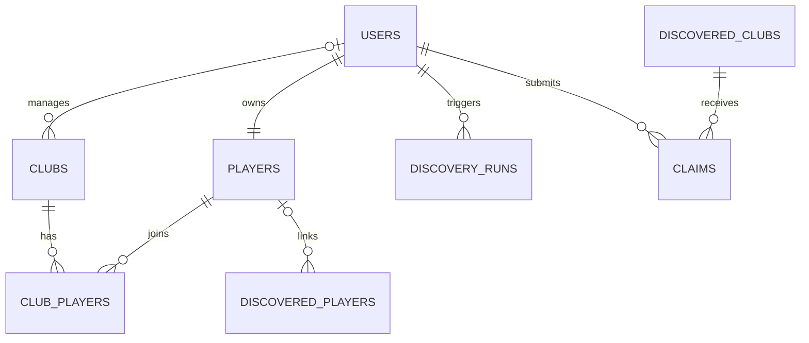
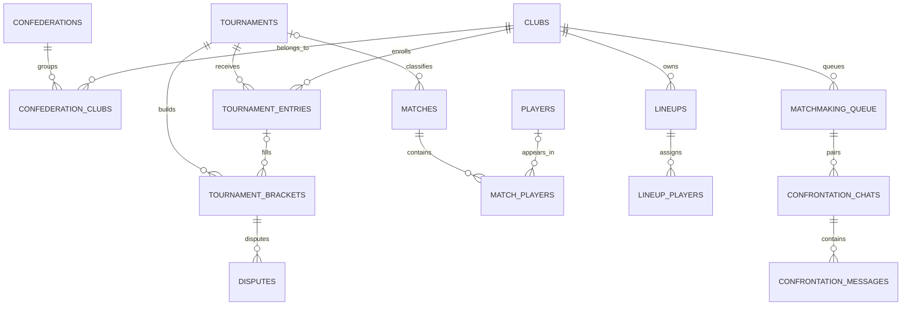
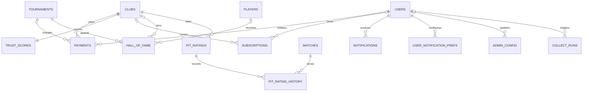

# Database

This project uses PostgreSQL 15+ through Supabase.

The schema is defined by the SQL migrations in `supabase/migrations` and mirrored by `src/types/database.ts`.

## Overview

- Database engine: PostgreSQL 15+ via Supabase
- Migration count: 37 SQL files
- Primary schema: `public`
- Storage usage: claim proof uploads and signed URLs
- Generated type target: `src/types/database.ts`

## Enum Types

| Enum | Values |
| --- | --- |
| `user_role` | `player`, `manager`, `moderator`, `admin` |
| `claim_status` | `pending`, `approved`, `rejected` |
| `club_status` | `unclaimed`, `pending`, `active`, `suspended`, `banned` |
| `player_position` | `GK`, `ZAG`, `VOL`, `MC`, `AE`, `AD`, `ATA` |
| `ea_position_category` | `goalkeeper`, `defender`, `midfielder`, `forward` |
| `match_type` | `championship`, `friendly_pit`, `friendly_external` |
| `matchmaking_status` | `waiting`, `matched`, `confirmed`, `expired`, `cancelled` |
| `confrontation_status` | `active`, `confirmed`, `expired`, `cancelled` |
| `payment_status` | `pending`, `paid`, `refunded`, `overdue`, `cancelled` |
| `tournament_type` | `corujao`, `league` |
| `tournament_format` | `single_elimination`, `group_stage_then_knockout`, `round_robin` |
| `tournament_status` | `draft`, `open`, `confirmed`, `in_progress`, `finished`, `cancelled` |
| `hall_of_fame_award` | `champion`, `mvp_final`, `top_scorer`, `top_assister`, `pitbull`, `muralha`, `best_avg_rating` |
| `dispute_status` | `open`, `under_review`, `resolved_wo`, `resolved_no_wo`, `dismissed` |
| `pit_league` | `access`, `bronze`, `silver`, `gold`, `elite` |
| `subscription_status` | `active`, `cancelled`, `expired`, `past_due` |
| `subscription_plan` | `free`, `premium_player`, `premium_team` |
| `notification_type` | `claim_approved`, `claim_rejected`, `match_found`, `match_expired`, `tournament_confirmed`, `tournament_cancelled`, `payment_due`, `payment_overdue`, `team_discovered`, `dispute_update`, `roster_invite`, `general` |

## Tables By Domain

### Core

| Table | Purpose | Key relations / notes |
| --- | --- | --- |
| `users` | Application user profile mirror for Supabase auth users. | `auth.users` source, `roles` array, public identity fields. |
| `players` | Competitive player profile and PIT positions. | `users.user_id`, unique `ea_gamertag`. |
| `clubs` | Managed teams known by PIT. | Manager relation to `users`, EA club identity, subscription plan, `last_scanned_at`. |
| `club_players` | Membership and invite rows between clubs and players. | Supports pending invites and active roster membership. |

### Discovery

| Table | Purpose | Key relations / notes |
| --- | --- | --- |
| `discovered_clubs` | Clubs found through discovery or manual admin insertion. | Links to claims and optional promoted PIT club. |
| `discovered_players` | Gamertags seen during scans before PIT signup. | Can later link to `players`. |
| `discovery_runs` | Telemetry for discovery scan jobs. | Stores counts, status, source, and error messages. |
| `claims` | Proof-backed requests to claim discovered clubs. | Reviewed by moderator or admin RPC flows. |

### Competition

| Table | Purpose | Key relations / notes |
| --- | --- | --- |
| `confederations` | Regional or organizational grouping for clubs and tournaments. | Owned by an admin user. |
| `confederation_clubs` | Active membership of clubs inside confederations. | Join table with lifecycle fields. |
| `tournaments` | Tournament configuration and lifecycle state. | Supports multiple formats and schedule metadata. |
| `tournament_entries` | Club enrollment, payment state, seeding, and final placement. | Also stores trust deadlines and PIX metadata. |
| `tournament_brackets` | Round-by-round pairings and progression graph. | Self-reference through `next_bracket_id`. |
| `matches` | Normalized match records collected from EA. | Holds classified PIT match types and tournament links. |
| `match_players` | Per-player stat lines for each collected match. | Stores raw EA role plus resolved PIT position. |
| `lineups` | Saved club formations for defaults or specific matches. | Belongs to one club, may target one match. |
| `lineup_players` | Player assignment to lineup slots. | `slot_id` models the 3-5-2 board positions. |
| `matchmaking_queue` | Queue entries for manager-driven matchmaking. | Tracks slot time, expiry, and match status. |
| `confrontation_chats` | Pairing and confirmation record between two queue entries. | Can later link to the collected match. |
| `confrontation_messages` | Chat messages inside a confrontation. | Participant-scoped RLS. |
| `disputes` | Moderator-reviewed tournament disputes. | Anchored to a bracket and the clubs involved. |

### Financial

| Table | Purpose | Key relations / notes |
| --- | --- | --- |
| `payments` | One-time and recurring payment ledger. | Sync target for Mercado Pago webhooks and refunds. |
| `trust_scores` | Strike and trust status per club. | Updated by payment deadlines and enforcement flows. |
| `subscriptions` | Recurring plan records for clubs or users. | Queried by admin subscription tooling. |

### Engagement

| Table | Purpose | Key relations / notes |
| --- | --- | --- |
| `hall_of_fame` | Tournament awards and historical honors. | Stores champion, MVP, scorer, and rating awards. |
| `pit_ratings` | Current competitive rating per club and season. | Includes league, calibration, and record counters. |
| `pit_rating_history` | Rating delta history per match. | Linked to `pit_ratings` and `matches`. |
| `notifications` | In-app notifications for key user events. | Generic JSON payload plus read state. |
| `user_notification_prefs` | Per-user notification toggles. | Composite key on user and notification type. |

### System

| Table | Purpose | Key relations / notes |
| --- | --- | --- |
| `admin_config` | Runtime settings managed from admin routes. | Stores JSON values keyed by config name. |
| `collect_runs` | Manual, cron, and tournament collect telemetry. | Includes scope, token, target club list, and failure counters. |

## ERD: Core and Discovery

## ERD: Competition

## ERD: Financial, Ratings, and System

## Views

| View | Purpose | Notes |
| --- | --- | --- |
| `v_player_stats` | Aggregated player profile stats. | Later migration filters out `friendly_external` matches. |
| `v_club_stats` | Aggregated club record and goal totals. | Counts wins, draws, losses, goals for, goals against. |
| `v_player_stats_by_position` | Aggregated player stats split by resolved PIT position. | Also filtered to PIT-relevant match types. |
| `v_financial_dashboard` | Daily revenue, refunds, pending totals, and overdue counts. | Used by admin financial routes. |
| `v_club_rankings` | Club ranking snapshot by season and rating. | Includes general and competitive ranks. |
| `v_tournaments_with_entries` | Tournament rows plus entry counters and paid totals. | Useful for dashboards and status checks. |

## RLS Summary

The migration history enables RLS and then layers route-specific policies.

High-level model:

- public reads for browseable entities such as users, players, clubs, matches, brackets, hall-of-fame, and ratings
- self-service writes for user-owned records such as profiles, claims, notifications, and notification preferences
- manager-scoped access for rosters, lineups, tournament entries, matchmaking queue, and trust summaries
- moderator and admin access for review flows, tournament operations, and dispute handling
- admin-only or system-only access for payments, discovery internals, admin config, and collect telemetry

Important policy references:

- `20260220120230_create_rls_policies.sql`
- `20260221120000_align_task4_rls.sql`
- `20260301040000_task13_rls_audit.sql`
- `20260307000000_task16_collect.sql`
- `20260317000002_task24_notification_prefs.sql`

## Triggers and Functions

Key functions:

| Function | Purpose |
| --- | --- |
| `update_updated_at()` | Standard timestamp refresh helper used by many tables. |
| `fn_handle_new_user()` | Mirrors new auth users into `public.users` and bootstrap player data. |
| `fn_create_trust_score()` | Ensures a club gets a trust score record. |
| `fn_approve_claim()` | Approves a claim and promotes discovered club data into the main club graph. |
| `fn_reject_claim()` | Rejects a claim with moderator context and reason tracking. |
| `fn_sync_manager_role_from_club()` | Keeps manager role membership aligned with club ownership. |
| `fn_resolve_position()` | Maps EA categories and player preferences into PIT positions. |
| `fn_increment_strike()` | Applies trust score strike logic. |
| `fn_calculate_elo_delta()` | Computes rating deltas for competitive results. |
| `increment_discovered_club_scan_count()` | Updates discovery scan counters. |

Key triggers:

- `on_auth_user_created`
- `trg_club_create_trust`
- `trg_claim_approved`
- table-level `updated_at` triggers for mutable entities
- `trg_user_notification_prefs_updated_at`

## Schema Evolution Notes

Later migrations extend the baseline schema with a few important additions:

- `users.roles` changed from a single role to a `user_role[]` array
- `clubs.last_scanned_at` supports discovery and collect rate limiting
- `collect_runs` gained `scope`, `collect_token`, `clubs_total`, `clubs_failed`, and target club payloads
- `lineup_players.slot_id` models explicit formation slots for the 3-5-2 board
- `tournament_entries` gained `trust_deadline` and PIX metadata columns
- `user_notification_prefs` stores per-type in-app notification choices
- discovery runs gained `run_type` for manual vs automatic attribution

## References

- [`src/types/database.ts`](../src/types/database.ts)
- [`supabase/migrations`](../supabase/migrations)
- [docs/API.md](./API.md)
- [docs/ARCHITECTURE.md](./ARCHITECTURE.md)
